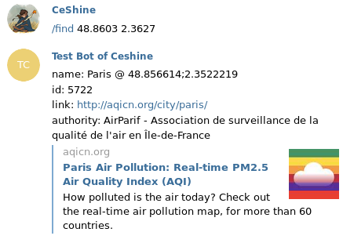
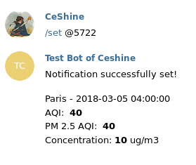
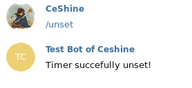

# aqi-bot

A minimal Telegram AQI notification bot

## Set Up
You need to provide two environment variables:
1. AQI_TOKEN
2. BOT_TOKEN

### AQI token
Get your token from [aqi.cn](http://aqicn.org/data-platform/token/#/).

### Bot token
Get your token from [@BotFather](https://telegram.me/BotFather)

### Docker
We provide a simple Dockerfile and sample docker-compose.yml for you to get started.

## Usage
### 1. Find the nearest station
`/find <lat> <lng>`

### 2. Subscribe
Use the station id from `/find`.
`/set <station_id>`

### 3. Unsubsribe
`/unset`

## Missing Features

### 1. Persistence
Currently the bot will lose track of all subscriptions if it is restarted.

### 2. Adaptive notification
Adjust behaviors according to the pollution level.

### 3. More robust schedule
Sometimes the update from an station can be delayed for more than 20 minutes(the maximum allowed delay in the current setting). Need a retry mechanism.

### 4. Testing Mechanism
A public testing bot seems necessary. But has to consider ways to avoid abusing.
